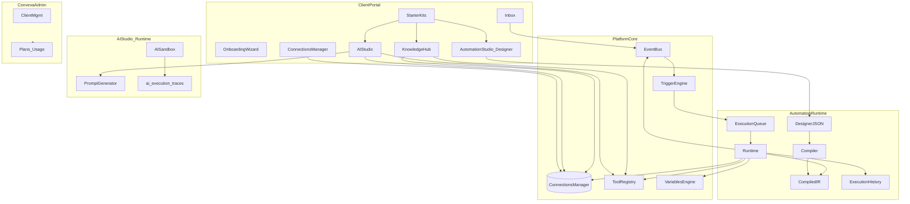

# Phase 3 — Convexa DIY Platform (ARCHITECTURE LOCKED)

## SINGLE SOURCE OF TRUTH (LOCKED)

This plan is the SSOT. Stop redesigning. Implement only.

**Vision:** Customer Communication Platform (not “another WhatsApp CRM”). Clients BYO Meta Cloud API + AI keys. Convexa sells software only.

### Implementation law

- Do **not** redesign, rename, or invent platform modules.
- Do **not** duplicate or move responsibilities; no shortcuts that bypass platform services.
- Prefer **extension** over modification; composition over duplication.
- Every feature is **`account_id`-scoped**, observable, testable.
- Externals → **Connections Manager** (`connection_id` only; health/status/reconnect).
- Async → **Event Bus** (analytics, audit, notifications subscribe).
- AI + Automation capabilities → shared **Tool Registry** (register, never hardcode).
- Automation executes **compiled IR only** (Queued/Running/Waiting/Retry/Failed/Completed/Cancelled).
- UI: guided, “what next?”, hide complexity; Advanced Mode for raw config.
- Premium capabilities → **feature flags / plan entitlements** (extend plans — not a new module).
- Actions → **permission checks** (extend existing roles/capabilities — not a new module).
- AI Memory layers stay separate: Conversation / Customer / Knowledge / Business (/ future Agent).

### Canonical modules (closed set — never add #11)

1. Connections Manager  
2. Event Bus  
3. Tool Registry  
4. Trigger Engine  
5. Variables Engine (`customer`, `conversation`, `company`, `agent`, `knowledge`, `automation`, `ai`, `global`, `system`)  
6. Automation Runtime  
7. AI Studio (+ Sandbox, Memory, Versions)  
8. Knowledge Hub  
9. Starter Kits (not Marketplace)  
10. Convexa Admin  

Before coding: find which module owns the responsibility and extend it.

---

## Business model (LOCKED)

**Convexa = software only.** Clients connect their own Meta App / WABA / phone / token and their own AI keys. Meta and LLM billing stay client ↔ provider.

| Forbidden now | Future hooks only |
|---------------|-------------------|
| BSP / number resale | `connection.provider_mode` later |
| Reseller / sub-clients | not productized |
| White-label | entitlement flag later |
| Public marketplace | **Starter Kits** only |

**Tenant:** one client = one `account`; **`account_id` only**.

**Surfaces:** Client Portal (no admin) vs hidden **Convexa Admin**.

---

## Target architecture diagram



---

## Module responsibilities (LOCKED)

### Connections Manager
Account-scoped integrations; secrets once; all callers use `connection_id`. Migrate Meta (`whatsapp_config`) and LLM (`ai_configs`) behind adapters then connections.

### Event Bus
Publish/subscribe: WhatsApp inbound, assign, message sent, AI reply, broadcast completed, payment received (stub), workflow finished. No new cross-module hard coupling.

### Tool Registry
Shared tools for AI Studio + Automation Runtime: CRM, ERP, REST, SQL, Webhook, Email, Payments (stub). New integrations = register tool + connection.

### Trigger Engine
WhatsApp, Webhook, Schedule, Manual, API, CRM, Payment, Conversation — WhatsApp + Manual first; others stub/wire.

### Variables Engine
Namespaces: `customer`, `conversation`, `company`, `agent`, `ai`, `knowledge`, `automation`, `global`.

### Automation Runtime
Designer (author only) → Compiler → versioned IR → Queue → Runtime (IR only) → History. Never execute designer JSON.

### AI Studio
Wizard (business, products, tone, restrictions, languages, support hours, guardrails) → auto-generated system prompt. Sandbox: prompt, retrieval, tools, latency, tokens, cost, confidence, response.

### Knowledge Hub
Documents, Sync Status, Chunks, Embeddings, Last Sync, Refresh, Errors, Version. Sources now: PDF, Website, FAQ, Manual. Docs/Notion later.

### Starter Kits
Industry packs install automation + knowledge + AI config + templates + quick replies + fields + tags. **Not** a marketplace.

### Convexa Admin
Hidden: clients, suspend/activate, manual plans, usage, logs, support, health, flags, platform settings.

---

## Compatibility with current codebase

| Existing | Maps to |
|----------|---------|
| `whatsapp_config` | Connections Manager (Meta) |
| `ai_configs` | Connections Manager (LLM) |
| Flow canvas + `engine.ts` | Automation Runtime layers |
| `flow_runs` / events | Queue + History |
| `ai_knowledge` | Knowledge Hub |
| Webhook dispatch | Event Bus → Trigger Engine; keep Automation → legacy automations → AI order |
| Flow templates | Starter Kits |

---

## Execution order (LOCKED)

```text
Wave A   Security / account_id defense-in-depth
Wave B   Inbox enterprise UX
Wave C0  Connections → Event Bus → Tool Registry → Variables → Trigger Engine
Wave C1  Automation Runtime: Compiler / IR / Queue / Runtime / History
Wave C2  AI Studio + Sandbox + Knowledge Hub + Onboarding + Starter Kits
Wave D   Convexa Admin + software plans/usage
Final    Enterprise Readiness Report
```

C1–C2 require C0 first.

---

## Deliverables

1. Waves A–D in order under implementation law  
2. Platform core + Automation Runtime IR path  
3. AI Studio + Knowledge Hub + Sandbox + Starter Kits + Onboarding  
4. Hidden Convexa Admin + usage  
5. Readiness report + extensibility hooks note (BSP/white-label unimplemented)  

**Targets:** DIY client ~8/10 after C2; multi-client ops ~7/10 after D.
