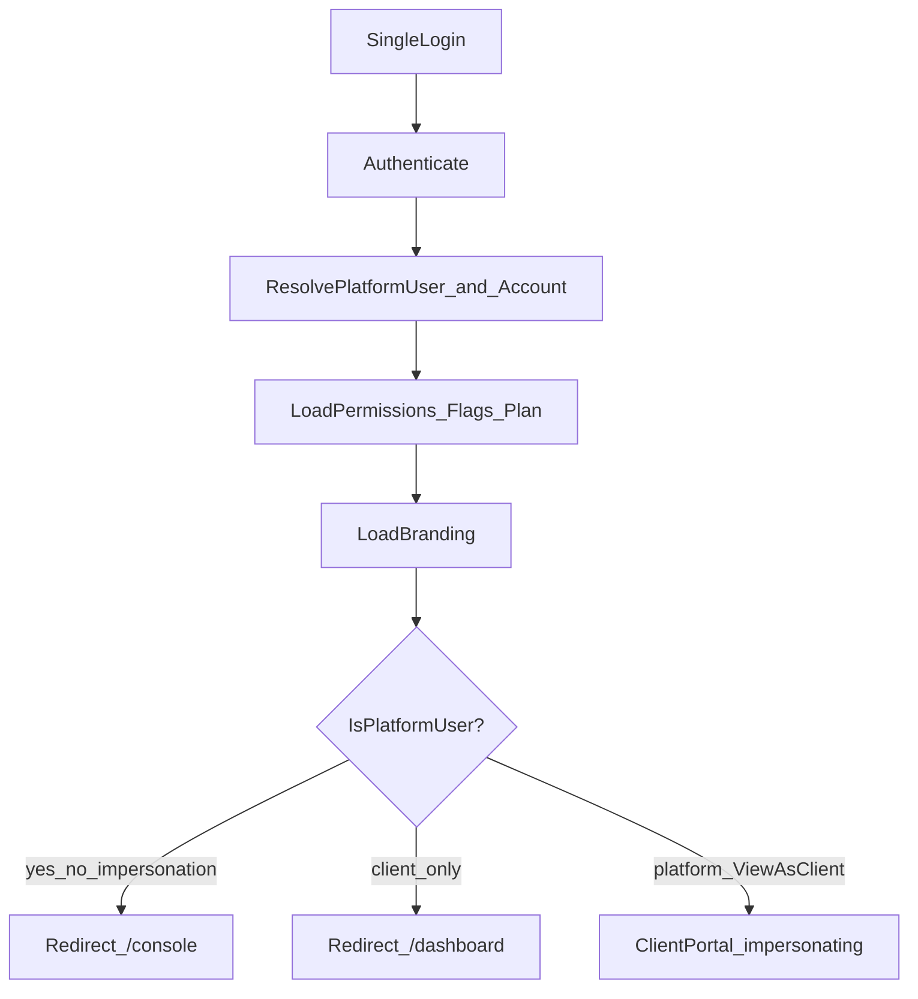

# Product Experience Shell (Wave 1) — FINAL PRODUCT LOCK

## Absolute locks

**Do NOT redesign or rename:** Connections Manager, Event Bus, Tool Registry, Trigger Engine, Variables Engine, Automation Runtime, AI Studio, Knowledge Hub, Starter Kits, Convexa Admin, **Permission Engine**, **Feature Flags**.

**Do NOT:** introduce new platform concepts, duplicate services, or add an 11th product module.

**Goal:** implementation quality — UX polish, consistency, performance, accessibility, production readiness.

Permission Engine and Feature Flags are **first-class locked modules** delivered in Wave 1 (thin libs + tables), then frozen like the rest.

---

## Product principles (LOCKED)

1. Simple beats configurable  
2. One click to common actions  
3. Every empty page teaches  
4. Every page answers “What do I do next?”  
5. No dead ends  
6. Never expose technical terms  
7. Everything should be searchable (Wave 1: clients; Ctrl+K hook reserved)  
8. Every action reversible where possible  
9. Every important event → activity log  
10. Support solves without screenshots (**View As Client**)  

**Every Wave 1 screen must ship:** clear title · short explanation · primary action · empty state · what-next · loading skeleton · consistent toast errors.

Prefer wizards / checklists / Starter Kits over large config screens. Advanced Mode for raw/technical options only.

---

## Role / access decisions (unchanged)

- Client roles: `owner | admin | manager | agent | viewer` (`manager` added now).  
- `PLATFORM_ADMIN_EMAILS` = bootstrap only → upsert `platform_users`; then DB + Permission Engine only.  
- Wave 1 platform roles: `owner` | `admin`. Support/Sales/Finance later without architecture change.

---

## Workspace context (MANDATORY chrome)

Every authenticated screen shows **Current Workspace** in the shell header:

| Surface | Shows |
|---------|--------|
| Platform Console | Workspace: **Convexa** (platform) |
| Client Portal | Workspace: **{Company}** · Plan name · Status (Active/Suspended) |
| View As Client | Permanent banner: **Viewing as {Company}** + **[Exit Client View]** |

Never leave ambiguity about which company is managed. Account switcher (platform) changes workspace context without re-login.

---

## Login → experience

---

## Data model — `045_experience_shell.sql`

1. Extend `account_role_enum` with `manager`; update `is_account_member` ranks.  
2. `platform_users` (`user_id`, `platform_role`, `status`, `last_login_at`).  
3. `permissions` + `role_permissions` seeds (Permission Engine).  
4. `feature_flags` (global + optional `account_id` override).  
5. Account branding: `logo_url`, `primary_color`, `display_name`.  
6. `impersonation_sessions`.  
7. Activity via existing **Event Bus** table `platform_events` (no duplicate log service) for: WhatsApp/AI connect signals where already emitted, suspend/activate, plan change, impersonation start/end, automation published / broadcast sent when easy to hook — **do not invent a second activity system**.

---

## Permission Engine + Feature Flags (implement once, then lock)

- [`src/lib/auth/permissions.ts`](src/lib/auth/permissions.ts) — `can` / `requirePermission`; no `role ===` in new UI.  
- Feature flags + plan entitlements gate nav and modules.  
- Bootstrap: allowlist → upsert platform user → thereafter DB only ([`platform-admin.ts`](src/lib/auth/platform-admin.ts)).  
- Cache grants in session context (instant nav).

---

## Session / workspace context API

`GET /api/session/context` (client-cached):

`surface`, `platformUser`, `workspace` (id, name, plan, status), `accountRole`, `permissions[]`, `featureFlags`, `branding`, `impersonation`, `switchableAccounts[]`, `onboardingChecklist?`, `health?`

Cookies: `convexa_account_id`, `convexa_impersonate` (httpOnly).

---

## Shells — two products, one URL

| Surface | Routes | Shell |
|---------|--------|--------|
| Platform | `/console/*` | `PlatformShell` — Convexa branding, platform nav |
| Client | existing `(dashboard)` | `ClientShell` — client nav, branding, Powered by Convexa |
| Auth | `(auth)` | Single login |

Redirect old `/admin` → `/console`. Middleware + login: platform → `/console`; client → `/dashboard`; View As → client with banner.

**Nav registry only** — filtered by permissions × flags × plan × workspace surface. Never hardcode menus.

---

## Guided UX + empty states (Wave 1)

Shared [`PageHeader`](src/components/ui/) / `EmptyGuide` pattern used on console + key client modules:

- **Inbox** — No conversations → Connect WhatsApp → Send test → Ready  
- **AI Studio** — No AI → Connect provider → Knowledge → Test → Auto-reply  
- **Knowledge Hub** — No docs → FAQ / paste / (PDF-website later) → Done  
- **Automation Studio** — No workflows → Starter Kit → Create → Publish  

Reuse/extend existing [`/onboarding`](src/app/(dashboard)/onboarding/page.tsx) as **Client checklist** (visible progress): Connect WhatsApp, Test message, Connect AI, Upload Knowledge, Invite team, First automation, Publish flow, Complete. Auto-surface after new client / incomplete setup — reduces support.

---

## Platform dashboard — “Is the platform healthy?”

`/console` answers health, not vanity:

- Clients (total / active / suspended)  
- Plans distribution  
- Usage (messages / AI / automations this period)  
- WhatsApp connections count · AI connections count  
- Queue / workers / realtime / webhook: **best-effort status from existing cron/tables** (honest “Unknown” if not instrumented — no fake green)  
- Recent platform activity (from `platform_events`)  
- Recent client activity (aggregate)  
- Billing: **placeholder card only** (“Coming later”)

Clean, sparse, Shopify/Vercel-like density — not a generic CRM dashboard.

---

## Client dashboard — “How is my business doing?”

Account-scoped only ([`dashboard/queries.ts`](src/lib/dashboard/queries.ts) extended lightly): messages, conversations, broadcasts, AI usage, automation runs, response-ish metrics if available, open deals, contacts, team activity, knowledge usage. **Zero platform metrics.**

---

## Client Management + Health score

`/console/clients` — searchable cards/table:

Company, plan, status, created, users, WhatsApp/AI connected, messages this month, **health: Healthy | Warning | Critical**, last activity when available.

**Health score** (computed, not a new module): roll up WhatsApp connected, AI configured, knowledge has docs, any active automation/flow, recent login/presence if cheap. Supports principle #10.

Actions (Wave 1): View · Suspend · Activate · Assign plan · **View As Client**. No dead stubs for Delete/Reset password/Trial.

---

## Activity vs Notifications (separation locked)

| | Activity | Notifications |
|--|----------|----------------|
| Meaning | History of important events | Action-required alerts |
| Wave 1 | Write + show recent feed on `/console` (and client dashboard strip if cheap) | **Do not build a second center** — keep using existing client notifications; platform alerts later |
| Later | Audit Logs UI | Platform + Client notification centers |

Never mix the two in one undifferentiated list in future UI.

---

## View As Client (critical)

One-click from client card → full Client Portal as that workspace → permanent **Viewing as** banner → Exit → `/console`. Log start/end. Same UX as customer. Primary support tool.

---

## Command palette (hook only)

Reserve Ctrl+K: [`src/lib/nav/commands.ts`](src/lib/nav/commands.ts) registry of command ids (Search client, Open Inbox, View As, …) wired to a no-op or minimal stub listener. **Full palette UI later.** Satisfies “everything searchable” architecture without scope blowup.

---

## Design system consistency (Wave 1)

Reuse existing shadcn/tokens — no visual redesign of brand colors. Standardize: spacing, `PageHeader`, cards, forms, buttons, empty guides, skeletons, toasts. Same product language on platform and client (different chrome/nav only).

---

## Performance

Cache session context (permissions, flags, workspace, branding) in memory + short SWR; soft-navigate on workspace switch; lazy-load heavy console/client routes.

---

## Explicit later (hooks only — do not implement)

Full Monitoring suite, Audit UI, Announcements, Billing/Subscriptions revenue, Notification Center split UI, full Ctrl+K, PDF/website Knowledge crawl, Reset password / Delete client / Trial extend, Support/Sales/Finance roles, BSP / White-label / Marketplace / Reseller / Voice / IG / FB / Telegram / Email channels / Public SDK.

---

## Success criteria

On login the user knows: where they are · what next · workspace health · what needs attention · how to finish setup · how to get value. Support uses View As without screenshots. Clients configure without docs. Minimum clicks. Feels polished and enterprise-ready.

---

## Implementation order

1. Migration `045` + seeds  
2. Permission Engine + Feature Flags + bootstrap  
3. Session/workspace context + cache  
4. Shells + workspace chrome + routing  
5. Nav registry  
6. PageHeader / EmptyGuide + module empty states + client checklist  
7. Platform health dashboard + Clients (health + View As) + Plans + Settings  
8. Client dashboard polish (business-only)  
9. Impersonation banner/switcher + activity writes  
10. Command registry stub  
11. Feature gates on existing modules  
12. Smoke + a11y pass on new chrome  

## Key files

- New: `045_experience_shell.sql`, `permissions.ts`, `nav/registry.ts`, `nav/commands.ts`, `(platform)/console/**`, `components/platform/**`, `components/ux/page-header.tsx`, `empty-guide.tsx`, `api/session/context`, `api/platform/impersonate`  
- Extend: `platform-admin.ts`, `roles.ts`, `use-auth.tsx`, `middleware.ts`, `login`, `dashboard-shell`, sidebar/header, onboarding, dashboard queries  
- Redirect: `(convexa-admin)/admin` → `/console`
